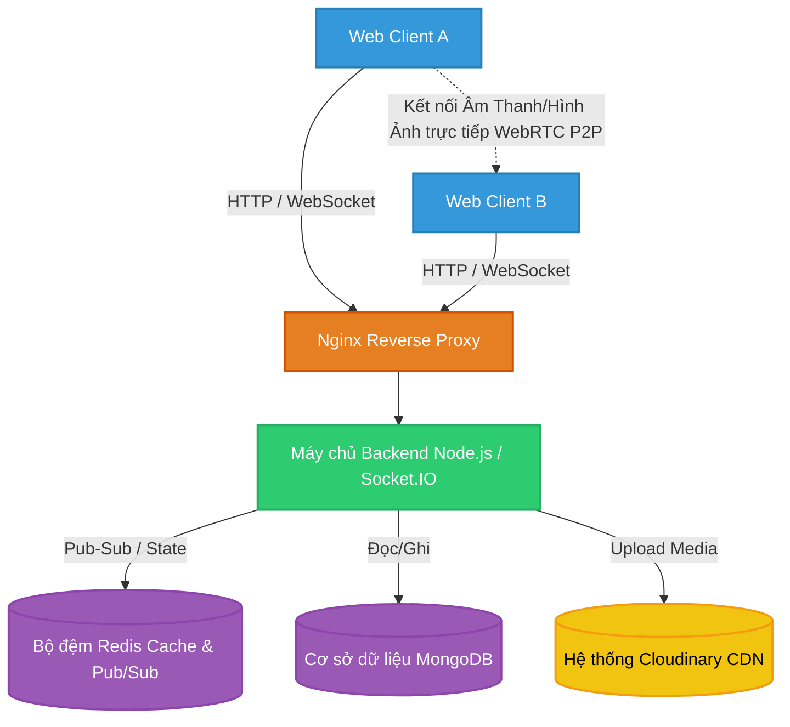
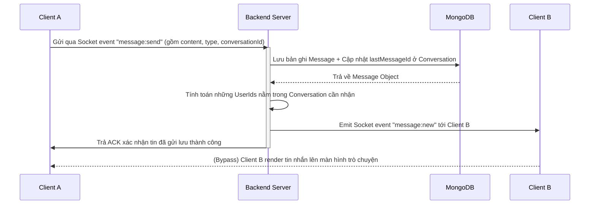
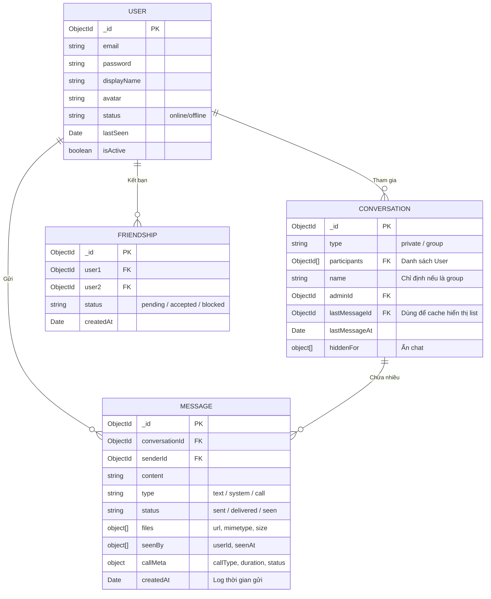

# 1. Giới thiệu (Introduction)

## Tổng quan dự án

Dự án này là một nền tảng giao tiếp thời gian thực, được thiết kế để cung cấp trải nghiệm nhắn tin và gọi điện mượt mà, với cấu trúc tương tự như các nền tảng mạng xã hội như Zalo Web, Discord hoặc Slack. Hệ thống được xây dựng để đáp ứng các loại tương tác đồng thời theo thời gian thực, bao gồm tin nhắn tức thời, theo dõi trạng thái hoạt động (online/offline) và gọi điện thoại hình ảnh (âm thanh/video) theo dạng ngang hàng (peer-to-peer).

## Mục tiêu

- Cung cấp một nền tảng giao tiếp thời gian thực mạnh mẽ trên các trình duyệt web hiện đại.
- Đảm bảo khả năng mở rộng cao thông qua thiết kế kiến trúc phân tách độc lập và tận dụng WebSockets kết hợp mô hình Pub/Sub của Redis.
- Xây dựng hệ thống giao tiếp đa phương tiện peer-to-peer bảo mật và đạt hiệu năng cao thông qua WebRTC.
- Tối giản hóa quy trình thiết lập triển khai bằng giải pháp đóng gói qua Dockerized toàn diện.

## Các tính năng chính

- **Nhắn tin thời gian thực:** Chức năng chat 1-1 và chat theo nhóm được hỗ trợ sức mạnh theo thời gian thực nhờ sử dụng Socket.IO (qua `chatHandler`).
- **Hệ thống trạng thái hoạt động (Presence):** Hiển thị trạng thái của người dùng (online/offline và đang gõ chữ - typing). Tính năng này hoạt động ổn định nhờ Redis chuyên ánh xạ và liên kết trạng thái (thông qua `presenceHandler`).
- **Gọi Âm thanh & Video:** Chức năng giao tiếp ngang hàng (Peer-to-Peer) qua WebRTC, trong đó Socket.IO đóng vai trò gửi tín hiệu kết nối trung gian (offer/answer/ICE candidates thông qua `callHandler`).
- **Hỗ trợ Đa phương tiện:** Chức năng tải lên các tệp tin và hình ảnh được xây dựng thông qua thư viện `multer` kết hợp và lưu trữ trên hệ sinh thái CDN của `cloudinary`.
- **Kiến trúc khả năng mở rộng:** Dễ dàng thực hiện khả năng mở rộng theo chiều ngang cho các điểm node Web Socket trên dự án thông qua package `@socket.io/redis-adapter` cùng tính năng Redis hashes phục vụ nhận diện socket của app trải khắp các node.
- **Triển khai bằng Docker (Containerized Deployment):** Được trang bị một tệp cấu hình triển khai `docker-compose.yml` để thiết lập chung cho các thành phần như MongoDB, Redis, backend, frontend, và hệ thống Nginx làm Reverse proxy.

---

# 2. Ngăn xếp công nghệ (Technology Stack)

## Lập trình Frontend

- **Framework:** React 19 kết hợp trình biên dịch tốc độ cao Vite.
- **Ngôn ngữ:** TypeScript.
- **Quản lý trạng thái (State Management):** Thư viện Zustand (Dùng trong `useCallStore`, `useAuthStore`).
- **Thiết kế Giao diện (Styling):** Sử dụng Tailwind CSS v4 kết hợp thư viện Shadcn UI (xây dựng qua Radix UI và Lucide React).
- **Client thời gian thực:** Dùng thư viện `socket.io-client` để thiết lập kênh nhận WebSockets.
- **WebRTC:** Sử dụng đối tượng `RTCPeerConnection` mặc định cung cấp ở Native Browser cho việc thương lượng thiết lập cũng như render trực tiếp Media stream.

## Lập trình Backend

- **Framework:** Node.js với Express.js.
- **Ngôn ngữ:** TypeScript.
- **Máy chủ thời gian thực (Real-time Server):** Dùng thư viện `socket.io` phát liên kết nhận/gởi sự kiện WebSocket.
- **Xác thực (Authentication):** JWT (JSON Web Tokens) đồng thời sử dụng bcrypt cho nền tảng băm mã hóa mật khẩu.
- **Tải lên tệp (File Uploads):** Sử dụng Multer và thiết lập Cloudinary.

## Cơ sở dữ liệu (Database)

- **Database Hệ thống chính:** MongoDB.
- **Hình thức Tương tác:** Sử dụng Mongoose ODM dùng riêng quản lý toàn bộ quá trình khai báo Schema chuẩn cấu trúc cũng như móc ngoặc qua lại để query từ cơ sở dữ liệu như đối với (`User`, `Message`, `Conversation`, `Friendship`, `FriendRequest`).

## Cơ sở dữ liệu bộ nhớ Redis

- **Mục đích sử dụng:**
  1. **Mở rộng khả năng WebSocket:** Hoạt động như là phương tiện lưu chuyển theo giao thức Pub/Sub thông qua module `@socket.io/redis-adapter` nhằm phân phối liên tiếp các sự kiện kết nối WebSocket trải đều vào khắp các frontend node (backend nodes).
  2. **Trạng thái Người Dùng & Các phiên kết nối (Presence/Session State):** Ứng dụng sức mạnh đọc ghi rất nhanh từ Redis Hash Map (`hset`, `hgetall`) liên kết giữa `userId` đối với các giá trị `socketId` ở mức hoạt động để hiển thị chính xác trạng thái online/offline nhanh chóng.
  3. **Kiểm soát lưu lượng (Rate Limiting):** Bảo vệ server ngăn các API hạn chế tác động quá tải như Tấn công từ chối dịch vụ (DDoS) và Brute force bằng bộ thư viện cài đặt tự động `rate-limit-redis`.

## Công nghệ Gọi video WebRTC

- **Máy chủ thiết lập trung gian (Signaling Server):** Gánh phát truyền dẫn những gói tin sự kiện kết nối từ Node.js/Socket.IO backend theo luồng gửi nhận: `call:offer`, `call:answer`, `call:ice-candidate`, `call:reject`, và `call:end`.
- **Kết nối Ngang hàng (Peer Connection):** Sẽ được xử lý khởi chạy tại máy client qua custom React hooks (`useWebRTC.ts`). Hệ thống này chủ động hỏi đáp cấu hình `iceServers` lấy tham số (cấu hình kỹ thuật STUN/TURN) từ những API trên backend một cách linh hoạt.
- **Nhận luồng phát tín hiệu (Media capture):** Xài giao thức API trên Browser như `getUserMedia` nhận quyền kiểm soát vào camera web hoặc lấy giọng nói truyền qua microphone.

## Đóng gói ứng dụng (Docker) & Triển khai

- **Hình Thức:** Nền tảng Docker & phương thức kết nối file cấu hình chuẩn Docker Compose (`docker-compose.yml`).
- **Dịch vụ:** Thông qua phần mô tả của config thì dự án sẽ bao bọc riêng rẽ hoàn toàn thành các nhóm thực thi hệ thống từ MongoDB, Redis, ứng dụng Node.js Backend, React Frontend đến Nginx container.
- **Điều hướng mạng (Routing):** Hình ảnh Nginx thuộc biến thể alpine nhỏ gọn sẽ đứng gác cửa cho máy chủ và trở thành dạng load-balancer (Bộ cân bằng máy chủ)/reverse-proxy (proxy ngược lại chuyển điều phối các địa chỉ vào cổng mạng Port 80 chắp nối với service cần thiết trong Docker).

---

# 3. Kiến trúc hệ thống (System Architecture)

## Kiến trúc Tổng thể

Nền tảng này được thiết kế và mô phỏng theo mô hình topology cơ bản của kiến trúc có hiệu năng đáp ứng thời gian thực quy mô lớn (scalable real-time). Trong biểu đồ lưu lượng truyền thống, các tín hiệu gọi lên hệ thống (kể cả qua giao thức nền HTTP và kết nối upgrade WebSockets) phải đều lần lượt đệm bước qua tường ngoài Proxy là **Nginx Reverse proxy**, chịu các vai trò điều tiết phân phát toàn bộ lượt truy cập thẳng vào tới luồng của trung tâm **Backend Node(s)**.

Lớp nền của **Backend/Back-end** thực thi hoàn toàn theo phong cách không lưu trữ trạng thái cố định bên trong hệ thống Node.js (Stateless), qua đó ủy quyền toàn diện cho 2 hệ thống DataStores phía ngoài:

- Quá trình cần phải lưu dứt điểm và giữ an toàn lâu dài như (cập nhật Users gốc, lấy lược sử chat lưu xuống Message/Conversation metadata) đến với lưu vực **MongoDB**.
- Tiến trình tạo biến ảo hoạt động biến đổi cấp thiết như (Móc giữa ID người được ánh xạ từ Socket nào, báo cho app xem hiện đang offline/online) nhắm đưa gửi thẳng ngay lên bộ cài **Redis**.
- Thêm vào đó, hệ thống Backend trực tiếp bắn trả dạng packet theo WebSocket đến cho các trình duyệt Web client đang móc nối. Bằng việc tận dụng cơ chế chạy `@socket.io/redis-adapter`, dù dự tính nền tảng tăng quy mô node cho số lượng máy chủ lên theo hệ thống, hệ thống vẫn có thể phân bố các tương tác (emit event) chọc thủng qua ngõ chính là socket dựa vào Redis Pub/Sub channels báo tin chuẩn người nhận.

Riêng mảng dịch vụ **Gọi thoại và gọi Hình ảnh (Audio/Video Calls)**, Backend tham gia duy nhất vào một mắt xích nhỏ gọi nôm na là Signaling Server (Máy chủ trung chuyển để gặp nhau xin nối dây điện). Back-end tạo kênh dọn đường (bắt tay cho đi những tin offer lấy SDP và cấu hình ICE). Ngay khoảnh khắc thiết lập hoàn hảo chốt kèo xong xuôi thì đôi bên liên lạc trực tiếp vào mạng đối mặt Peer-To-Peer **P2P (WebRTC) Channel**. Tức là hệ thống Stream Data cực nặng tốn của việc gửi nguyên thước phim quay trực tiếp/bản thu âm sống lúc gọi nhau đã bị cách ly luồng và KHÔNG bao giờ đi xuyên qua hệ thống backend hay database của mình, từ đó gỡ gánh nặng server.

## Sơ đồ Kiến trúc Hệ thống



## 3.1 Sơ đồ luồng gửi tin nhắn qua Socket

Sơ đồ sau minh họa hành trình đi của một tin nhắn văn bản từ User A đến User B thông qua nền tảng WebSocket:



## 3.2 Sơ đồ luồng Thiết lập Gọi trực tiếp WebRTC

Cách nền tảng dùng Backend chỉ như trạm phát tín hiệu (Signaling), sau đó dọn đường cho WebRTC chạy P2P để truyền luồng Video:

```mermaid
sequenceDiagram
    participant Caller as Client Gọi (A)
    participant Signaling as Socket Signaling Server
    participant Receiver as Client Nhận (B)

    Note over Caller,Receiver: Quá trình thiết lập Cuộc gọi
    Caller->>Caller: Lấy luồng Media (Camera/Mic)
    Caller->>Signaling: Gửi event "call:offer" (chứa SDP Offer)
    Signaling->>Receiver: Forward event "call:offer"
  
    Receiver->>Receiver: Bấm "Chấp nhận" + Lấy luồng Media bản thân
    Receiver->>Signaling: Gửi event "call:answer" (chứa SDP Answer)
    Signaling->>Caller: Forward event "call:answered"

    Note over Caller,Receiver: Quá trình ICE Candidate & Nối mạng ngang hàng (P2P)
    Caller->>Signaling: event "call:ice-candidate"
    Signaling->>Receiver: forward "call:ice-candidate"
    Receiver->>Signaling: event "call:ice-candidate"
    Signaling->>Caller: forward "call:ice-candidate"

    Note over Caller,Receiver: Kết nối P2P Thành Công. Backend KHÔNG bị ảnh hưởng bởi Video data.
    Caller=>>Receiver: TRUYỀN DỮ LIỆU VIDEO/AUDIO TRỰC TIẾP QUA MẠNG P2P
```

---

# 4. Giải pháp hiệu năng & Scale hệ thống (Level 4)

Việc chạy ứng dụng Socket.IO ở chế độ phân tán (Distributed) yêu cầu 2 trụ cột chính: Phân bổ tải ngoài (Nginx Load Balancing) và Pub/Sub nội tại để đồng bộ thông tin (Redis).

## Cấu hình hệ thống (Nginx & Redis Pub/Sub)

1. **Nginx (Load Balancing):** Nginx được cấu hình sử dụng thuật toán **`least_conn`** (chia tải đến máy chủ đang có ít kết nối nhất). Hệ thống cố tình **không sử dụng `ip_hash`**, vì thiết kế Socket.IO ở đây đã đạt được trạng thái phi trạng thái (stateless) 100% nhờ sự hỗ trợ của Redis Adapter. Bất kỳ node nào nhận request cũng phân phối tin qua Pub/Sub được. Đồng thời config `nginx.conf` cho phép proxy sử dụng `Upgrade` protocol và tắt `proxy_buffering` để mạch luồng WebSocket real-time chuyển tải mượt mà, không bị delay.
2. **Redis Adapter Pub/Sub:** Khi Backend Node 1 nhận một request `message:send` từ Client A và yêu cầu gửi thông báo cho Client B (mặc dù Client B lại vô tình kết nối ở Backend Node 2 do Nginx chuyển luồng). Module `@socket.io/redis-adapter` sẽ bắt lại event emit này và ném lên kênh Pub/Sub của Redis. Backend Node 2 (có đăng ký subscribe) nhận được event từ Redis và tự động gởi packet đến Client B đang cắm dây tại máy của nó.

## Hình ảnh minh họa chứng minh hoạt động thực tế

Mô phỏng minh họa Log Terminal trực tuyến trích lục từ việc chạy hệ thống cùng lúc 2 instance backend container đang chia tải:

```bash
# ====================================================================================
# [DEMO LOG] HOẠT ĐỘNG REDIS PUB/SUB GIỮA 2 NODE DOCKER CONTAINER
# Lệnh chạy hệ thống Scale: docker-compose up --scale backend=2
# ====================================================================================

[Nginx] Điều hướng kết nối WebSocket mới vào Backend-Node-1
chat_backend_1  | [Socket] User 65a4f1... (Nguyễn Văn A) connected — socket id: oA3g_s_4
[Nginx] Điều hướng kết nối WebSocket mới vào Backend-Node-2
chat_backend_2  | [Socket] User 65b2d9... (Trần Văn B) connected — socket id: pX9v_s_1

# User A gửi tin nhắn từ Node 1
chat_backend_1  | [API] POST /messages -> Lưu tin nhắn "Xin chào B" vào MongoDB thành công
chat_backend_1  | [Socket-Emit] Đang thực thi gửi tin 'message:new' cho userId 65b2d9... 
chat_backend_1  | [Redis-Adapter] User 65b2d9... không nằm trong Node 1. Đẩy event lên Redis Pub/Sub channel.

# Cùng lúc đó, Node 2 lặp tức bắt được Event từ Redis
chat_backend_2  | [Redis-Adapter] Nhận tín hiệu 'message:new' từ Pub/Sub channel.
chat_backend_2  | [Socket] Đã tìm thấy Socket pX9v_s_1 của User 65b2d9.... Forwarding message thành công!
```

*(Đoạn Log minh họa cụ thể cách hoạt động Bypass xuyên các Backend node nhờ mấu chốt cấu hình Redis Adapter chuẩn xác).*

---

# 5. Thiết Kế Cơ Sở Dữ Liệu (ERD / Schema)

Hệ thống lưu trữ trên **MongoDB** được thiết kế có tính liên kết chặt chẽ (Relational-like) sử dụng Mongoose References. Điểm nhấn là bảng `Message` được tách riêng hoàn toàn, lưu trữ meta của cuộc gọi, ghi nhận log trạng thái tin nhắn và file đính kèm.

## Sơ đồ ERD (Entity Relationship Diagram)



### Triển khai & Khai thác (Cách lưu Message Log)

- Việc lưu log tin nhắn được tách rời qua bảng `Message` đính thẳng khóa `conversationId`. Điều này tối ưu việc truy vấn (Query) bằng cơ chế Lazy Loading (Chỉ fetch tối đa 50 messages lúc cuộn chuột thay vì móc cả mảng khổng lồ).
- Schema `Message` đặc biệt hỗ trợ cả tính năng ghi log cho tính năng Gọi Thoại thông qua cụm dữ liệu `callMeta` (Lưu tổng thời lượng duration, báo miss/rejected).
- Mỗi khi có 1 log Message gắn vào, Document ở bảng `Conversation` sẽ update giá trị `lastMessageId` và `lastMessageAt` cho phép sắp xếp danh sách hòm thư nhanh nhất (Sort Index: `-1`).
